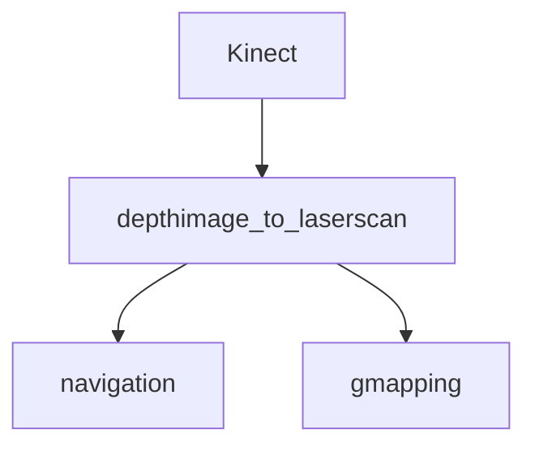

## SLAM ROS ROBOT:


### Introduction:
This is the code for programming Victoria Robot with SLAM based capabilities. 
It uses ROS and Arduino Mega alongside a laptop as the main computational machine. The robot works with a Kinect 360 camera which has ROS driver support.



depthimage_to_laserscan 


```
roslaunch Victoria robot_config.launch 
```

```
roslaunch Victoria slam.launch 
```
