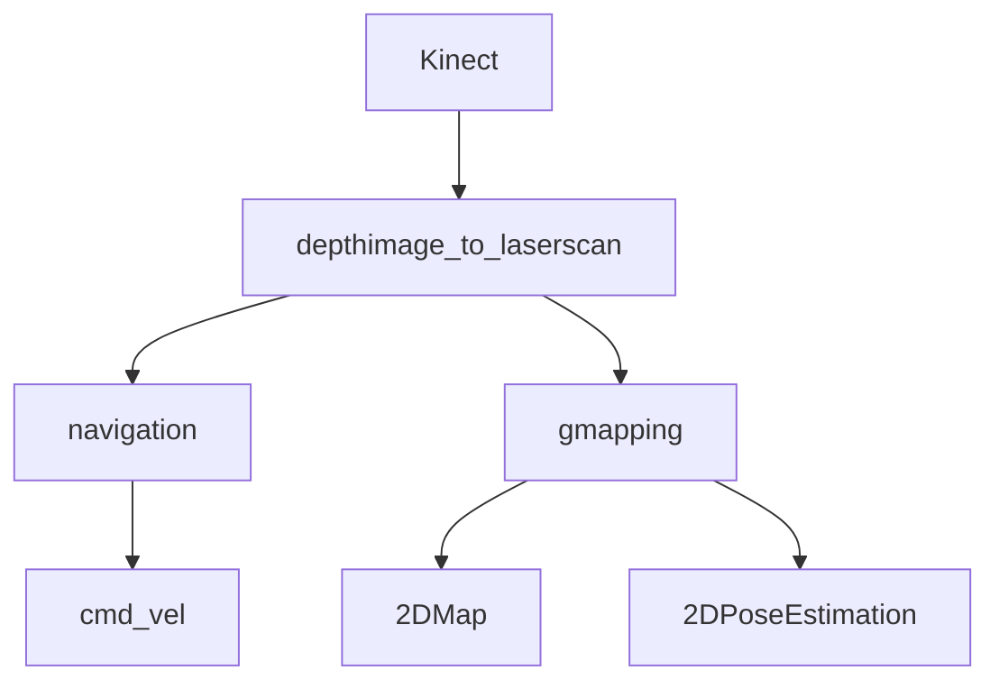

## SLAM ROS ROBOT:


### Introduction:
This is the code for programming Victoria Robot with SLAM based capabilities. 
It uses ROS and Arduino Mega alongside a laptop as the main computational machine. The robot works with a Kinect 360 camera which has ROS driver support. DC motors have integrated encoders for odometry readings.

The project was developed under **ROS Hydro Ubuntu** distribution **12.04 LTS**. This is now an old version but porting to ROS Melodic and ROS 2 is in roadmap for the near future.

### ROS Packages used:

* This project uses the ROS 1 Navigation stack under GMapping and AMCL.
* Communication between Arduino Mega and ROS is establish using [rosserial](http://wiki.ros.org/rosserial_arduino).
* Depthimage_to_laserscan: this will provide a "fake" laser readings as the 3D point cloud provide by kinect will be cut by a horizontal plane converting the point cloud to a 2D laser ROS type.
* The robot is controled using remote control with [teleop_twist_keyboard](http://wiki.ros.org/teleop_twist_keyboard).



depthimage_to_laserscan 


```
roslaunch Victoria robot_config.launch 
```

```
roslaunch Victoria slam.launch 
```
