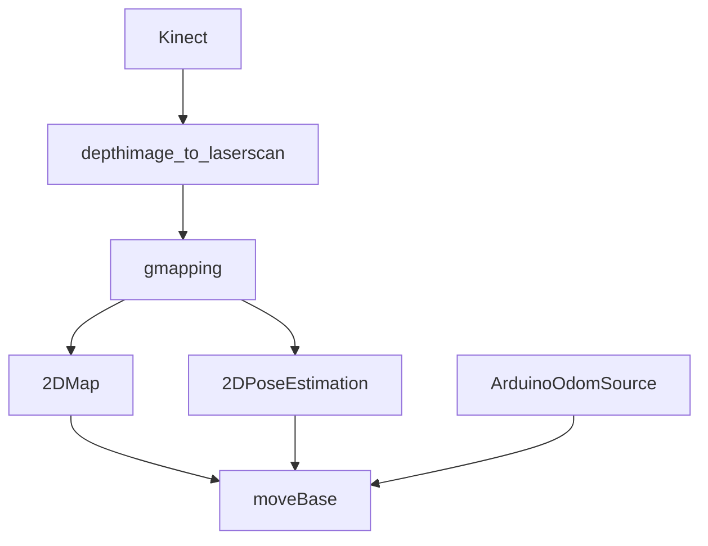

## SLAM ROS ROBOT:


### Introduction:
This is the code for programming Victoria Robot with SLAM based capabilities. 
It uses ROS and Arduino Mega alongside a laptop as the main computational machine. The robot works with a Kinect 360 camera which has ROS driver support. DC motors have integrated encoders for odometry readings.

The project was developed under **ROS Hydro Ubuntu** distribution **12.04 LTS**. This is now an old version but porting to ROS Melodic and ROS 2 is in roadmap for the near future.

### ROS Packages used:

* This project uses the ROS 1 Navigation stack under GMapping and AMCL.
* Communication between Arduino Mega and ROS is establish using [rosserial](http://wiki.ros.org/rosserial_arduino).
* Depthimage_to_laserscan: this will provide a "fake" laser readings as the 3D point cloud provide by kinect will be cut by a horizontal plane converting the point cloud to a 2D laser ROS type.
* The robot is controled using remote control with [teleop_twist_keyboard](http://wiki.ros.org/teleop_twist_keyboard).

### Autocad 3D model:

All the 3D dwp files are uploaded for simulating the robot. Also, urdf version for ROS was generated to visualice the robot in RVIZ.
The robot is a differential drive platform with two caster wheels and space for a laptop machine to be placed on top of the body.


The robot was built under Arduino technology. To control the DC motors, Adafruit motor shield was used and the available library.

### ROS & Arduino flow of control:



Example of RVIZ window running AMCL with costmap and 2d goal set.


For testing demostration, here is a video of remote controlling the robot and mapping generation SLAM process.

[](https://www.youtube.com/watch?v=j8H6GVUlBbM)

### Launching the system configuration.

Make sure to source both the workspace "catkin" and the ros installation under /opt/ros/

```
roslaunch Victoria robot_config.launch 
```

```
roslaunch Victoria slam.launch 
```

Rviz will be automatically iniciated both map visualization and costmap if AMCL is active.
